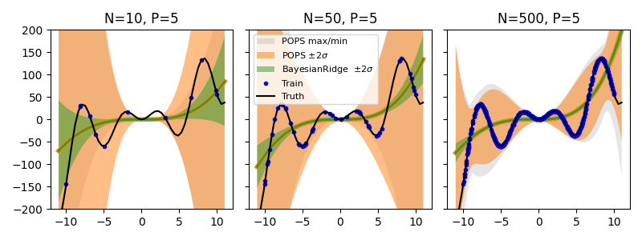

# POPS-UQ
Code for the paper: 

*Parameter uncertainties for imperfect surrogate models in the low-noise regime*

TD Swinburne and D Perez, [arXiv 2024](https://arxiv.org/abs/2402.01810v3)

```bibtex
@misc{swinburne2024,
      title={Parameter uncertainties for imperfect surrogate models in the low-noise regime}, 
      author={Thomas D Swinburne and Danny Perez},
      year={2024},
      eprint={2402.01810},
      archivePrefix={arXiv},
      primaryClass={stat.ML},
      url={https://arxiv.org/abs/2402.01810v3}, 
}
```

## Example usage

Usage follows `sklearn.linear_model.BayesianRidge` :

```python
from POPSRegressor import POPSRegressor

X_train,X_test,y_train,y_test = ...

# Default values- uniformly resample the hypercube with 1.0 samples / training point
model = POPSRegressor(resampling_method='uniform',resample_density=1.)

# fit the model, sample POPS hypercube
model.fit(X_train,y_train)

# returns std by default
y_pred, y_std = model.predict(X_test)

# can also return max/min 
y_pred, y_std, y_max, y_min = model.predict(X_test,return_bounds=True)

# can also resample the hypercube vectors
y_pred, y_std, y_max, y_min = model.predict(X_test,return_bounds=True,resample=True)

# can also return the epistemic uncertainty (descreases as 1/sqrt(n_samples))
y_pred, y_std, y_max, y_min, y_std_epistmic = model.predict(X_test,return_bounds=True,resample=True,return_epistemic_std=True)
```

As can be seen, the final error bars give very good coverage of the test output


